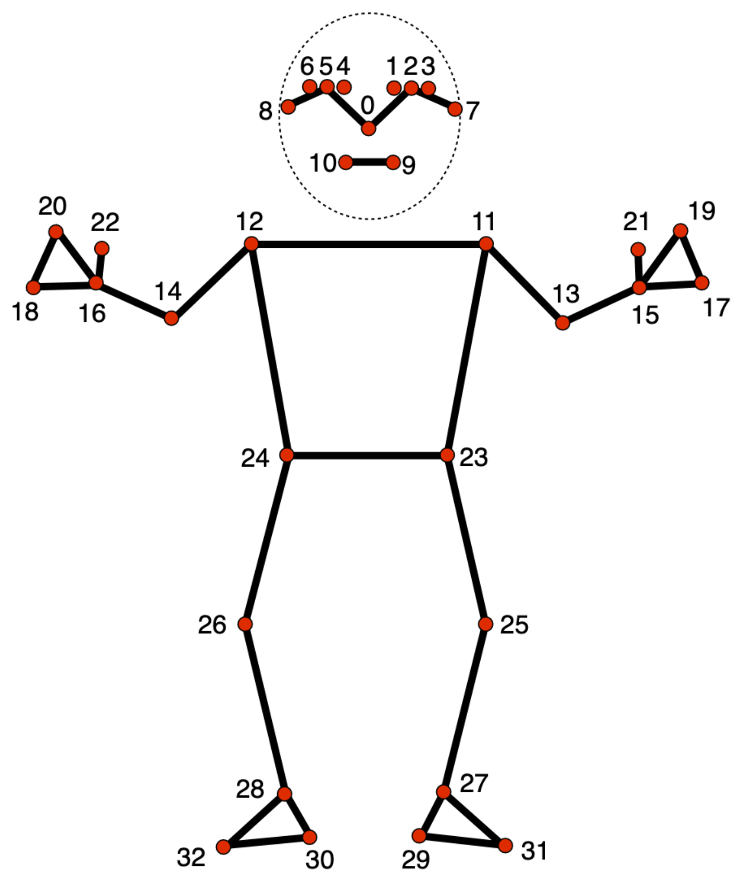

# Yolo v8 と mediapipeを用いて被採点者の骨格抽出を行う
[](https://www.python.org/downloads/release/python-399/)
[](https:///tensorflow.org)
[](https://ai.google.dev/edge/mediapipe/solutions/vision/pose_landmarker)

## 環境構築

<details>
<summary>クリックして開く</summary>

### dockerコンテナの作成
```bash
$ docker pull huggingface/transformers-pytorch-gpu:latest
$ docker run -it \
    -w /app \
    -v .:/app \
    -p 8080:8080 \
    --shm-size 16g \
    --gpus all \
    --name med_yolo
    huggingface/transformers-pytorch-gpu:latest bash
```
or
```bash
$ docker compose up -d
$ docker compose exec dk_ml /bin/bash
```

### コンテナの中身を作成
```bash
$ apt-get update -y && apt update -y
$ apt install curl git
```

### ライブラリのインストール
```bash
$ pip install -r requirements.txt
```

</details>

## 実行
### configファイルの構成
```json
{
    "originalVideo": "撮影したデータのパス, ex. data/sample-video.mp4",
    "boxedVideo": "バウンディングボックスを描画した動画のパス, ex. data/Annotated_BOX_sample.mp4",
    "annotatedVideo": "骨格アノテーションした動画のパス, ex. data/Annotated_POSE_sample.mp4",
    "boundingBoxData": "バウンディングボックスの情報を記載したCSVデータのパス, ex. data/Box_sample.csv",
    "poseLandmarkData": "骨格情報を記載したCSVデータのパス, ex. data/POSE_sample.csv",
    "targetIds": [1]
}
```

### オブジェクトトラッキング（YOLO）
```bash
$ cd src
$ python3 track.py [path to configfile]
```

### 骨格推定（Mediapipe）
```bash
$ cd src
$ python3 handly_pose.py [path to configfile]
```



## 参考
- [姿勢ランドマーク検出ガイド | Google API Edge | Google AI for Developers](https://ai.google.dev/edge/mediapipe/solutions/vision/pose_landmarker?hl=ja)
